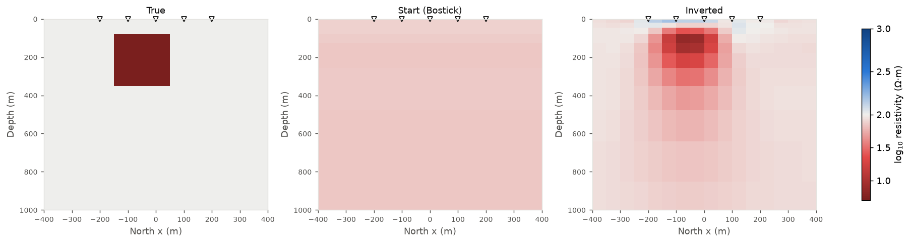
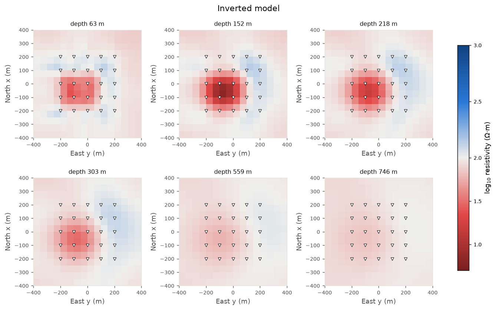
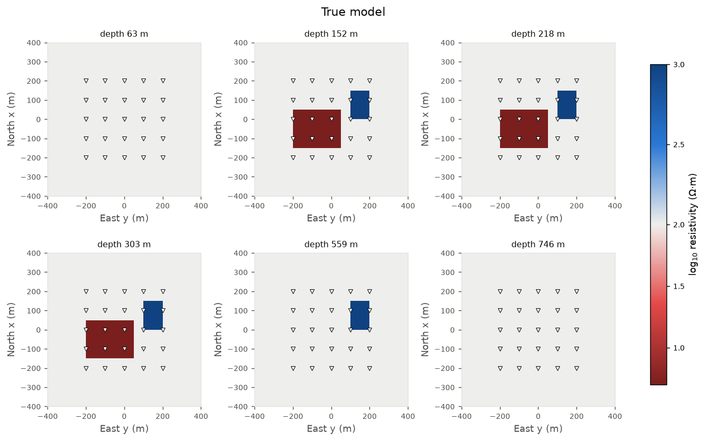
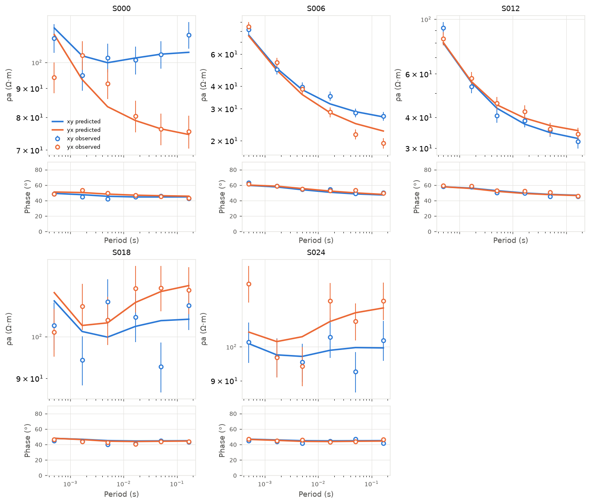
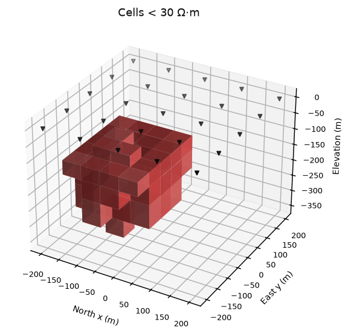
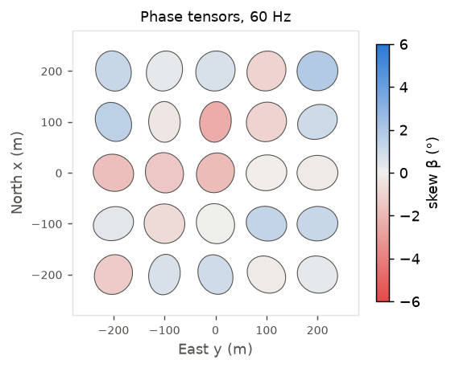
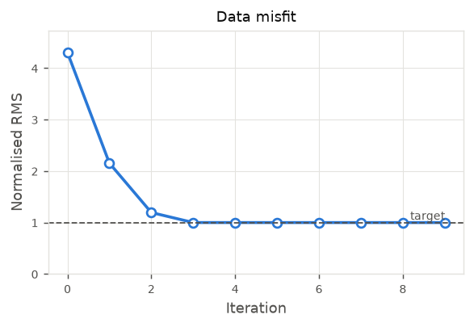

# amt3d: compact 3D AMT impedance inversion in Python

`amt3d` is a small, readable 3D magnetotelluric / audio-magnetotelluric (AMT)
inversion code. The whole package is about 900 lines of NumPy/SciPy code. It
reads and writes ModEM-format data files and includes plotting tools for
models, data fit and phase tensors.

It is built for **AMT-scale surveys**: tens of stations, a handful to a few
dozen frequencies, and models of roughly 10<sup>4</sup> cells (for example
porphyry Cu-Mo targets in the upper 1–2 km). At that scale, choices that would
not work for a large ModEM run become practical. Those choices are listed below.

## Design choices (and how they differ from ModEM)

| | ModEM (Egbert & Kelbert 2012; Kelbert et al. 2014) | amt3d |
|---|---|---|
| Forward solver | Iterative (BiCG/QMR + divergence correction) | **Sparse direct factorisation** (MKL Pardiso, SuperLU fallback) |
| Polarisations / adjoints | Separate iterative solves | **One factorisation per frequency**, reused for both polarisations and all adjoint solves |
| Jacobian | Not formed (NLCG) or implicit (DCG) | **Exact full Jacobian** from back-substitutions only |
| Model update | NLCG or data-space CG, user-set λ cooling | **Data-space Occam step** with eigen-decomposed trade-off curve |
| Choice of λ | Manual start value and cooling factor | **Automatic**: bisection on the linearised misfit (cheap after one `eigh`), then the smoothest model that still fits |
| Starting model | Usually a user-chosen half-space | **Data-driven 1D Niblett–Bostick** model from the station-averaged determinant impedance |
| Boundary conditions | 2D/1D solutions on the sides | 1D solution of the outer-ring conductivity |
| Visualisation | External tools | Built in: depth slices, sections, 3D voxels, soundings, phase-tensor maps, RMS maps, VTK for ParaView |

**Prior work behind these choices.** The ideas themselves are established. The
data-space method comes from Siripunvaraporn et al. (2005, WSINV3DMT), the
Occam λ search from Constable et al. (1987), direct solvers for 3D EM from
Grayver et al. (2013) and others, the Bostick transform from Bostick (1977)
and Niblett & Sayn-Wittgenstein (1960), and the phase tensor from Caldwell et
al. (2004). What `amt3d` adds is combining them in a short, transparent code
for small AMT problems. If you publish results from it, please cite these
works and describe the code honestly (see "Using this in a publication" below).

## Method in brief

* **Forward:** E-field on a staggered (Yee) grid, `exp(+iωt)`, so that
  `(CᵀM_f C + iω M_e(σ)) e = 0`. Tangential E on the outer boundary comes from
  a 1D solution. The impedance is `Z = E H⁻¹` from two polarisations at the
  surface. Coordinates follow ModEM: x = North, y = East, z = down.
* **Jacobian:** `dZ/d ln σ = Σₚ Lₚ K⁻¹ Gₚ`. It needs 2 × 4 × N<sub>stations</sub>
  adjoint back-substitutions per frequency on the existing factorisation. It is
  verified against finite differences in `tests/`.
* **Inversion:** minimise `‖W_d(d − F(m))‖² + λ‖m − m_ref‖²_{C_m⁻¹}`, with
  `C_m⁻¹ = α_s I + RᵀR`. Each iteration builds `G = J C_m Jᵀ = U S Uᵀ` once.
  Then `m(λ) = m_ref + C_m Jᵀ U (S + λ)⁻¹ Uᵀ d̂` and its linearised misfit cost
  O(N<sub>d</sub>) for any λ, so λ is chosen to reach the target misfit
  directly. A trial step that does not lower the true misfit is damped
  (λ × 10).
* **Errors:** ModEM-style floor, `err ≥ floor·√|Z_xy Z_yx|`.

## Install and run

```bash
pip install -r requirements.txt          # numpy scipy matplotlib (+ pypardiso, strongly recommended)
python -m pytest tests -q                # half-space vs analytic, Jacobian vs finite differences
python examples/synthetic_porphyry.py    # synthetic test, figures in ./results
python examples/invert_modem_file.py my_amt_data.dat --cell 50 --floor 0.05 --iters 10
```

```python
import amt3d
from amt3d import plot

obs  = amt3d.ImpedanceData.read_modem("data.dat").set_error_floor(0.05)
mesh = amt3d.Mesh.for_stations(obs.stations[:, 0], obs.stations[:, 1], cell=50,
                               max_period=obs.periods.max(), rho_bg=100)
sim  = amt3d.Simulation(mesh, obs.stations, obs.freqs)
m, pred, history = amt3d.invert(sim, obs, target_rms=1.0)
plot.plot_depth_slices(mesh, m, [50, 100, 200, 400], obs.stations)
plot.export_vtk(mesh, m, "model.vtk")
```

## Synthetic test results

`examples/synthetic_porphyry.py` uses a 5 × 5 station grid (100 m spacing)
and 6 frequencies from 2 kHz to 6 Hz. The model is a 100 Ω·m host with a 5 Ω·m
sulphide halo (100–400 m depth) and a 1000 Ω·m core to its east. Synthetic
data have 3% Gaussian noise and a 3% error floor. The mesh is
28 × 28 × 23 cells (13,328 inversion cells, about 50 k edge unknowns), and
there are 1,200 real data.

* Normalised RMS went from 4.30 (Bostick start) to 2.16, 1.20 and 1.00 in
  **3 iterations**. Later iterations only smooth the model at RMS 1.0.
* Each iteration (forward + full Jacobian, 6 frequencies) takes about 60 s on
  a 4-core cloud VM with MKL Pardiso.
* The halo is recovered in the right place with its top near 100 m. Its
  minimum resistivity is about 10 Ω·m (true value 5 Ω·m), and it is smeared
  below 400 m, as expected for a smooth inversion. The resistive core is
  imaged as a weaker resistive zone.

| | |
|---|---|
|  | |
|  |  |
|  |  |
|  |  |

## Limitations

* **Size:** direct solvers scale in memory roughly as N<sup>4/3</sup>–N<sup>1.5</sup>.
  About 50 k edge unknowns per frequency takes a few seconds with Pardiso.
  Meshes of millions of cells (regional MT) need ModEM's iterative approach.
* **Jacobian memory:** the dense J has size N<sub>data</sub> × N<sub>cells</sub>.
  This is fine for AMT surveys but grows quickly.
* **Data types:** full impedance only. There is no tipper yet (the H<sub>z</sub>
  faces are available, so tipper is a natural next step). There is no
  topography and no static-shift parameters.
* **Boundary conditions:** these are 1D, so keep enough padding (the mesh
  builder pads to about 3 skin depths of the longest period). The dependence of
  the boundary values on the outermost padding ring is left out of J (about
  0.1% effect; see the tests).
* **Highest frequencies:** with a 20 m first layer the 2 kHz half-space
  response is within about 7% in ρ<sub>a</sub> and 2° in phase. Use a thinner
  first layer if you need the highest AMT band to be more accurate.
* **Synthetic test:** the synthetic data are computed on the same mesh used in
  the inversion (an "inverse crime"). This is optimistic.
* **Not yet benchmarked against ModEM.** No claim of being better than ModEM
  holds until both codes are run on the same data. See below.

## Using this in a publication

To claim an improvement over ModEM, show it:

1. Run both codes on a standard model (for example DTM1 from the 3D MT
   inversion workshops, or COMMEMI 3D-1A/2A) and on your field data, with the
   same mesh, data, errors and target misfit.
2. Report wall-clock time, memory, iterations, final RMS and model recovery.
3. Generate synthetic data on a finer mesh than the one used for inversion.
4. Describe the code as an implementation that combines established methods
   (cite them as above). This code was written with help from an AI assistant
   (Claude). Most journals now require that to be disclosed.
